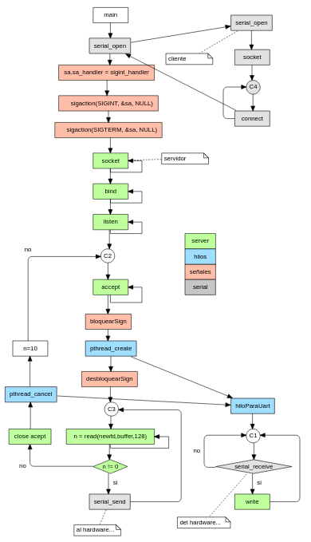

# - Trabajos finales TP1 y TP2
- __curso__: Sistemas Operativos de Proposito General
- __Alumno__: Josue Elias Huaman
- __cohorte__: 16 - 2022
- __link oficial (contraseña: sopg)__: [link](https://campus.fi.uba.ar/course/view.php?id=1444)
- __link del drive__: [link](https://drive.google.com/drive/folders/1YJVUjCFdnf04KviSjVsyGK2OInBDQSub)
# - TP 1
## -- consideraciones
Se usa como archivos base los que se encuentran en la carpeta __clase_4__ (__reader.c__ y __writer.c__)
## -- ejecucion
- ubicate en la carpeta __TP1__
- ejecuta el archivo _compilar.sh_ para ejecutar los archivos objetos
- ir a la carpeta __objetos__ y ejecuta los archivos objectos en distintas terminales: 
```bash
./writer
./reader
```
## -- log...
- escribe lo que quieras dentro de la terminal de writer
## -- sign...
- Dentro de la carpeta __automatizacion__ ejecutar el siguiente comando y copia el ID del proceso en la fila PID.
```bash
./id.sh
```
- Asumamos que el ID del proceso __writer__ es __1234__ y que queremos mandar las señales 1 y 2 al archivo __Sign.txt__. Para ello ejecutar el file __bash.sh__ dos veces de la siguiente manera:

```bash
./bash.sh 1 1234
./bash.sh 2 1234
```

sal de writer con __control + c__. entra a la carpeta __salidas__ y revisarlos los archivos __Log.txt__ y __Sign.txt__ y ver los resultados.

# - TP 2
Flujo del programa:


## -- consideraciones
- para iniciar el proyecto, tomamos como archivos base los que se encuentran en las siguientes rutas: __clase5/ejemplos_sockets_2021/server_tcp.c__ y __clase_6/Ejemplos_Threads_2019/Ejemplo_signals/main.c__
- la plantilla del TP2 se extrajo de la carpeta __clase_6/Tp_Final_V2_domotica_campus__
- una vez copiado todos los archivos se cambio la primera linea de los archivos de la carpeta __cgi-bin__ de __#! /usr/bin/env python__ por __#! /usr/bin/env python3__


## -- ejecucion
Dentro del la carpeta del repositorio ejecutar los siguientes comando en terminales distintas.

```bash
# terminal 1: Desde la carpeta del repositorio...
cd ./TP2/EmuladorHardware
python3 Emulador.py
# terminal 2: Desde la carpeta del repositorio...
cd ./TP2/SerialServiceEsqueleto
./compilar.sh
./serialService
# terminal 3: Desde la carpeta del repositorio...
cd ./TP2/InterfaceService
python3 Main_python3.py
# terminal 4: Desde la carpeta del repositorio...
cd ./TP2/web
./runserver_python3.sh
```
# - verificacion
## -- Verificiar el consumo de CPU
Ejecutar el siguiente comando. Se vera que el valor del CPU es el adecuado.
```bash
top
```
## -- señales SIGTERM y SIGINT
Ejecutar los siguientes comandos para terminar con el proceso.
```bash
# para buscar PID del proceso ejecutar:
ps aux | grep serialService 
# ahora termina el programa dandole la señal:
kill -s SIGINT <pid>
# o ...
kill -s SIGTERM <pid>
# En caso quieras ver cuantos hilos estan ejecutandose al mismo tiempo, ejecutar:
ps -o nlwp <pid>
```
## -- funcionamiento de leds
- presionar los botones en la pagina principal y vera camibion en la emulacion de hardware.
- controlar el emulador y ver como se cambian los valores en la pagina.
## -- terminacion del proceso interfaseService
en la consola de el archivo python interfaseService teclear control + c. Podra verificar que el servidor no esta caido, sino esta esperando a un nuevo cliente.
# - organizacion de carpetas
```
|-- bimestre-3-SOPG-2 (carpeta de repositorio)
    |-- clase_3 (descargada del link del curso)
    |-- clase_4 (descargada del link del curso)
    |-- clase_5 (descargada del link del curso)
    |-- clase_6 (descargada del link del curso)
    |-- ejecutables (ejecutables de las clases. Esto es para no modificar los archivos descagardos)
    |-- TP1 (trabajo final)
    |-- TP2 (trabajo final)
    |-- ejecutar.sh (compila los archivos C de las clases en la carpeta ejecutables)
    |-- README.md (documentacion)
```
